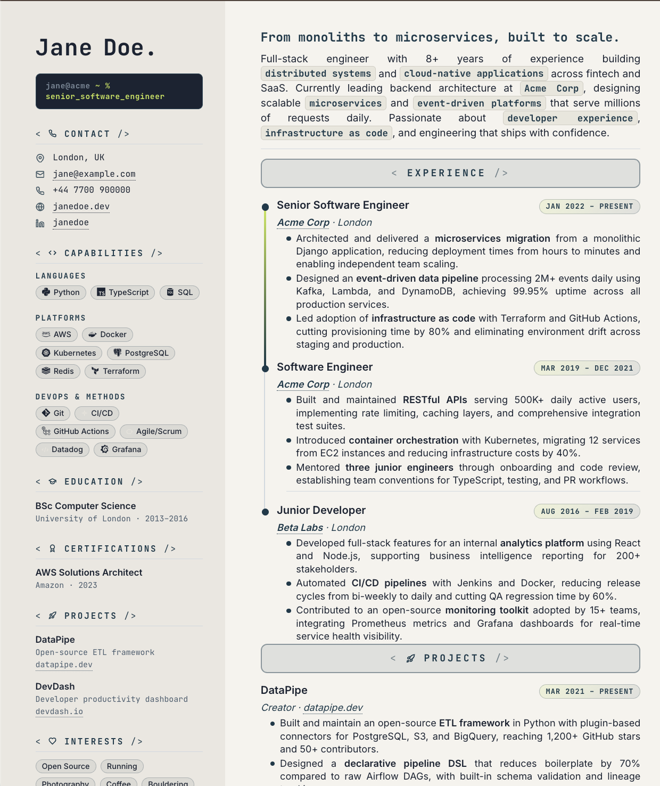

# Resume Builder

**A code-themed, editorial CV/resume builder that outputs a self-contained HTML file and exports to pixel-perfect PDF via Chrome headless.**

No build tools. No JavaScript frameworks. Just one HTML file, a shell script, and beautiful typography.



---

## Features

- **Two-column editorial layout** -- 70mm dark sidebar + flexible main column on A4
- **Terminal-style role tag** -- `hal@company ~ % senior_data_engineer`
- **JSX-style section headers** -- `< EXPERIENCE />` as full-width rounded pills
- **Vertical timeline** with dots, connector lines, and gradient promotions (lime to navy)
- **Inline `<code>` blocks** in summary text for keyword highlighting
- **Skill pills** with gradient backgrounds and brand icons (Devicon CDN)
- **Date range pills** with gradient fills
- **Contact section** with inline SVG Lucide-style icons
- **Monospace-heavy typography** (JetBrains Mono + Inter)
- **Dotted underlines** on clickable links
- **Three themes included** -- Neptune+Lime (default), Burgundy, Noir
- **Zero dependencies** -- pure HTML + CSS, no JavaScript required
- **Chrome headless PDF export** -- one command, pixel-perfect output

## Quick Start

```bash
# Clone the repository
git clone https://github.com/your-username/resume-builder.git
cd resume-builder

# Edit the template with your details
open templates/source.html   # or use your preferred editor

# Export to PDF
chmod +x scripts/export.sh
./scripts/export.sh
# -> output.pdf
```

### Custom input/output paths

```bash
./scripts/export.sh path/to/your-cv.html my-resume.pdf
```

## Customisation Guide

### Editing Content

Open `templates/source.html` and replace the placeholder content:

1. **Sidebar** -- Update contact details, skills, education, certifications, projects, and interests
2. **Main column** -- Update name, title, summary, and experience timeline
3. **Terminal tag** -- Change `jane@acme ~ %` to your own prompt
4. **Skill pills** -- Add/remove skills and swap icon classes

### Applying a Theme

Themes live in `themes/` as standalone CSS variable overrides. To switch themes, copy the `:root` block from a theme file and paste it into `source.html`, replacing the existing `:root` variables.

Available themes:
| Theme | File | Description |
|-------|------|-------------|
| Neptune + Lime | `themes/neptune-lime.css` | Dark navy sidebar, lime accents, cream page (default) |
| Burgundy | `themes/burgundy.css` | Light parchment sidebar, burgundy/wine accents |
| Noir | `themes/noir.css` | Full dark mode, electric cyan accents |

### Timeline

Each role is a `.timeline-entry` in the `.timeline` container:

```html
<div class="timeline-entry">
  <div class="tl-track"><div class="tl-dot"></div></div>
  <div class="tl-content">
    <div class="tl-header">
      <span class="tl-role">Your Title</span>
      <span class="tl-company">@ Company</span>
      <span class="date-pill">Jan 2020 – Present</span>
    </div>
    <ul class="tl-bullets">
      <li>Achievement with <code>technology</code>.</li>
    </ul>
  </div>
</div>
```

To show a **promotion** (gradient connector between roles at the same company), add the `promotion` class:

```html
<div class="timeline-entry promotion">
```

## Icon Reference

### Devicon (CDN)

These icons load automatically from the Devicon CDN. Use the `<i>` tag with the appropriate class:

| Skill | Class |
|-------|-------|
| Python | `devicon-python-plain` |
| TypeScript | `devicon-typescript-plain` |
| React | `devicon-react-original` |
| Node.js | `devicon-nodejs-plain` |
| PostgreSQL | `devicon-postgresql-plain` |
| AWS | `devicon-amazonwebservices-plain-wordmark` |
| Docker | `devicon-docker-plain` |
| Git | `devicon-git-plain` |
| Terraform | `devicon-terraform-plain` |
| Apache Spark | `devicon-apachespark-original` |
| Azure | `devicon-azure-plain` |
| Kafka | `devicon-apachekafka-original` |
| Azure DevOps | `devicon-azuredevops-plain` |

Browse all icons: [devicon.dev](https://devicon.dev/)

### Inline SVG (for brands without Devicon coverage)

Some tools require custom inline SVGs in the skill pill:

| Skill | SVG Description |
|-------|----------------|
| Databricks | Stacked diamonds logo |
| Power BI | Bar chart icon |
| Delta Lake | Triangle icon |
| Azure Data Factory | Connected blocks |
| CI/CD | Circular refresh arrows |

### Contact & Header Icons (Lucide-style)

Inline stroke SVGs used for contact items and section headers:

| Icon | Usage |
|------|-------|
| Map Pin | Location |
| Envelope (rect + polyline) | Email |
| Phone | Phone number |
| Globe | Website |
| LinkedIn (path + rect + circle) | LinkedIn profile |
| Code brackets | Capabilities header |
| Graduation cap | Education header |
| Medal | Certifications header |
| Rocket | Projects header |
| Heart | Interests header |
| Briefcase | Experience header |
| User | Contact header |

## Theme Variables Reference

```css
:root {
  /* Typography */
  --ink: #002233;          /* Headings, strong text */
  --soft: #3d5a6e;         /* Body text, secondary */
  --rule: #C0D6EA;         /* Borders, timeline lines */

  /* Accents */
  --accent-soft: #11425D;  /* Dark accent (sidebar bg, pills) */
  --lime: #DDFF55;         /* Highlight accent */

  /* Backgrounds */
  --bg-page: #F6F2E8;     /* Page background */
  --bg-side-start: #11425D;/* Sidebar gradient start */
  --bg-side-end: #002233;  /* Sidebar gradient end */

  /* Sidebar */
  --sidebar-text: #C0D6EA; /* Sidebar body text */
  --sidebar-heading: #DDFF55;/* Sidebar section titles */
  --sidebar-width: 70mm;   /* Sidebar column width */

  /* Fonts */
  --font-mono: 'JetBrains Mono', monospace;
  --font-body: 'Inter', sans-serif;

  /* Gradients */
  --pill-gradient: linear-gradient(135deg, var(--lime), var(--accent-soft));
  --date-gradient: linear-gradient(135deg, var(--accent-soft), var(--ink));
}
```

## Export Requirements

The PDF export uses **Chrome/Chromium headless mode**. The script auto-detects Chrome on macOS and Linux.

**Supported browsers:**
- Google Chrome
- Chromium
- Google Chrome Canary
- Brave Browser

**Override the Chrome path:**
```bash
CHROME_PATH="/path/to/chrome" ./scripts/export.sh
```

**Export command (manual):**
```bash
chrome \
  --headless \
  --disable-gpu \
  --virtual-time-budget=15000 \
  --run-all-compositor-stages-before-draw \
  --print-to-pdf="output.pdf" \
  --print-to-pdf-no-header \
  --no-margins \
  "file://$(pwd)/templates/source.html"
```

The `--virtual-time-budget=15000` flag ensures web fonts from Google Fonts CDN are fully loaded before rendering.

## Project Structure

```
resume-builder/
  templates/
    source.html        # Main template — edit this
  themes/
    neptune-lime.css   # Default theme variables
    burgundy.css       # Warm editorial theme
    noir.css           # Dark mode theme
  scripts/
    export.sh          # Chrome headless PDF export
  examples/
    screenshot.md      # Screenshot placeholder
  README.md
  LICENSE              # MIT
  .gitignore
```

## Credits

- **[Devicon](https://devicon.dev/)** -- Brand icons for programming languages and tools
- **[Lucide](https://lucide.dev/)** -- Design language for the stroke SVG icons
- **[Google Fonts](https://fonts.google.com/)** -- JetBrains Mono and Inter typefaces
- **[Chrome Headless](https://developer.chrome.com/docs/chromium/headless)** -- PDF rendering engine

## License

MIT License. Copyright (c) 2026 Hal Wall. See [LICENSE](LICENSE) for details.
